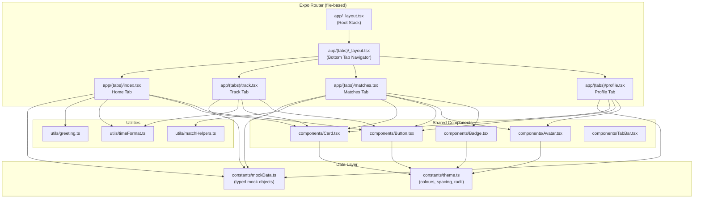

# Design Document: Home Screen

## Overview

The Home Screen is the primary post-authentication interface for COMMUTEity, built as a bottom-tab navigator with four sections: Home (greeting + schedule), Track (commute session control), Matches (overlap-based connections), and Profile (user info). The implementation uses Expo Router's file-based tab layout with React Native components styled via a shadcn/ui-inspired pattern (variant-driven, unstyled base, theme tokens).

All data is sourced from a local mock constants file matching the backend API response shapes. No network calls are made. The design prioritizes:

- **Composability**: Small, typed, reusable components (Card, Button, Avatar, Badge)
- **Testability**: Pure logic extracted into utility functions (greeting resolver, time formatter, match grouper)
- **Future-proofing**: Mock data typed to API contracts so swapping to real fetch is a one-line change per hook

## Architecture

### High-Level System Diagram



### Navigation Architecture

Expo Router v4 (bundled with SDK 57) provides file-based routing with a `(tabs)` directory convention that produces a bottom tab bar. Since SDK 56+, all navigation imports come from `expo-router` directly — no external `@react-navigation/*` imports are allowed.

```
app/
├── _layout.tsx              # Root Stack layout
├── (tabs)/
│   ├── _layout.tsx          # Tab navigator configuration
│   ├── index.tsx            # Home tab (default)
│   ├── track.tsx            # Track tab
│   ├── matches.tsx          # Matches tab
│   └── profile.tsx          # Profile tab
```

The tab layout uses `<Tabs>` from `expo-router` with `screenOptions` for shared styling and per-`<Tabs.Screen>` options for icons and labels.

## Components and Interfaces

### Shared Components

#### Card

```typescript
// components/Card.tsx
interface CardProps {
  children: React.ReactNode;
  title?: string;       // max 100 chars rendered
  subtitle?: string;    // max 200 chars rendered
  variant?: 'default' | 'elevated';
}
```

Renders a surface-coloured container. When `title` or `subtitle` is provided, renders them as header text. Always renders `children` below header content.

#### Button

```typescript
// components/Button.tsx
interface ButtonProps {
  label: string;          // max 50 chars rendered
  onPress: () => void;
  variant: 'primary' | 'secondary' | 'destructive';
  disabled?: boolean;     // default: false
  size?: 'default' | 'large';
}
```

Renders a pressable with theme-derived colours based on `variant`. When `disabled` is `true`, `onPress` is not invoked and a muted visual style applies. The `large` size ensures minimum 48×48dp touch target.

#### Avatar

```typescript
// components/Avatar.tsx
interface AvatarProps {
  name: string;
  imageUri?: string;
  size?: number;   // default: 48
}
```

Renders a circular container. When `imageUri` is provided, displays the image. Otherwise, renders the first character of `name` (uppercased) as a text fallback centred in the circle.

**Fallback logic (pure function):**
```typescript
function getAvatarInitial(name: string): string {
  return (name.charAt(0) || '?').toUpperCase();
}
```

#### Badge

```typescript
// components/Badge.tsx
interface BadgeProps {
  label: string;         // max 20 chars rendered
  variant: 'default' | 'success' | 'warning';
}
```

Renders a small pill-shaped container with background and text colours driven by `variant` from theme tokens.

#### TabBar (Custom Styling Wrapper)

The tab bar itself is provided by Expo Router's `<Tabs>` component. A custom `tabBarStyle` and `tabBarActiveTintColor` / `tabBarInactiveTintColor` in `screenOptions` handles styling. No separate `TabBar` component is needed unless the design requires a fully custom layout — in which case `expo-router/ui` components (`TabList`, `TabTrigger`, `TabSlot`) would be used.

For this MVP, we use the standard `<Tabs>` with `screenOptions`:

```typescript
// app/(tabs)/_layout.tsx
import { Tabs } from 'expo-router';
import { theme } from '@/constants/theme';

export default function TabLayout() {
  return (
    <Tabs
      screenOptions={{
        tabBarActiveTintColor: theme.colors.primary,
        tabBarInactiveTintColor: theme.colors.textSecondary,
        tabBarStyle: {
          backgroundColor: theme.colors.surface,
          borderTopWidth: 1,
          borderTopColor: theme.colors.border,
        },
        headerShown: false,
      }}
    >
      <Tabs.Screen name="index" options={{ title: 'Home' }} />
      <Tabs.Screen name="track" options={{ title: 'Track' }} />
      <Tabs.Screen name="matches" options={{ title: 'Matches' }} />
      <Tabs.Screen name="profile" options={{ title: 'Profile' }} />
    </Tabs>
  );
}
```

### Screen Components

#### Home Screen (index.tsx)

Composes:
- Greeting text (time-of-day + display name)
- ScrollView of `ScheduleCard` components

```typescript
// Greeting logic extracted to utils/greeting.ts
function getGreeting(hour: number): string {
  if (hour >= 5 && hour <= 11) return 'Good morning';
  if (hour >= 12 && hour <= 16) return 'Good afternoon';
  return 'Good evening';
}
```

#### Track Screen (track.tsx)

Manages a local state machine: `idle | active`

```typescript
// State shape
interface CommuteState {
  status: 'idle' | 'active';
  startedAt: number | null;  // Date.now() timestamp
}
```

When `status === 'active'`, a `useEffect` with `setInterval(1000)` updates elapsed time display. The elapsed time formatter is a pure utility:

```typescript
// utils/timeFormat.ts
function formatElapsedTime(totalSeconds: number): string {
  const hours = Math.floor(totalSeconds / 3600);
  const minutes = Math.floor((totalSeconds % 3600) / 60);
  const seconds = totalSeconds % 60;

  if (hours > 0) {
    return `${pad(hours)}:${pad(minutes)}:${pad(seconds)}`;
  }
  return `${pad(minutes)}:${pad(seconds)}`;
}

function pad(n: number): string {
  return n.toString().padStart(2, '0');
}
```

#### Matches Screen (matches.tsx)

Groups mock match data into `pending` and `connected` sections. Manages local state for user decisions (accept/decline).

```typescript
// utils/matchHelpers.ts
interface MatchEntry {
  matchId: string;
  overlapExplanation: string;
  sharedWindow: string;
  status: 'pending' | 'connected';
  matchedUser: { displayName: string; faculty?: string; year?: number; socials?: Socials };
}

function groupMatches(matches: MatchEntry[]): {
  pending: MatchEntry[];
  connected: MatchEntry[];
} {
  return {
    pending: matches.filter(m => m.status === 'pending'),
    connected: matches.filter(m => m.status === 'connected'),
  };
}
```

Match card rendering differs by status:
- **Pending**: Shows `overlapExplanation` + `sharedWindow`. Does NOT show `matchedUser` details.
- **Connected**: Shows `matchedUser.displayName`, `faculty`, `year`, socials, and `overlapExplanation`.

#### Profile Screen (profile.tsx)

Renders user profile data with conditional field display. Uses `Avatar` component for the initial-based placeholder.

```typescript
// Conditional rendering pattern
{profile.faculty && <Text>{profile.faculty}</Text>}
{profile.year && <Text>Year {profile.year}</Text>}
```

Buttons:
- "Edit Profile" → shows `Alert.alert('Edit Profile', 'Tap registered')`
- "Delete Account" → shows confirmation `Alert.alert` with Cancel/Delete options

### Utility Functions (Pure Logic)

| Function | File | Signature | Description |
|----------|------|-----------|-------------|
| `getGreeting` | `utils/greeting.ts` | `(hour: number) => string` | Maps hour [0-23] to greeting string |
| `formatElapsedTime` | `utils/timeFormat.ts` | `(totalSeconds: number) => string` | Formats seconds to MM:SS or HH:MM:SS |
| `formatScheduleTime` | `utils/timeFormat.ts` | `(time24: string) => string` | Converts 24h time string to 12h AM/PM |
| `getAvatarInitial` | `utils/avatar.ts` | `(name: string) => string` | Extracts uppercase first character |
| `groupMatches` | `utils/matchHelpers.ts` | `(matches: MatchEntry[]) => { pending, connected }` | Partitions matches by status |
| `getContrastRatio` | `utils/accessibility.ts` | `(fg: string, bg: string) => number` | Computes WCAG contrast ratio |

## Data Models

### TypeScript Interfaces (constants/mockData.ts)

```typescript
// Matches POST /commute/start response
export interface CommuteSessionStatus {
  sessionId: string;
  status: 'active' | 'idle';
}

// Matches POST /commute/end → notifications item
export interface MatchNotification {
  pairId: string;       // sorted user IDs joined by '#'
  otherUserId: string;
  text: string;
}

// Matches POST /match/opt-in response
export interface OptInResponse {
  mutualMatch: boolean;
}

// Matches GET /match/{pair_id}/profile response
export interface MatchProfile {
  userId: string;
  name: string;
  faculty?: string;
  year?: number;
  socials?: Socials;
}

// User profile (local)
export interface UserProfile {
  userId: string;
  displayName: string;
  email: string;
  homeArea: string;
  campusDestination: string;
  faculty?: string;
  year?: number;
  socials?: Socials;
}

export interface Socials {
  instagram?: string;
  linkedin?: string;
  discord?: string;
}

// Schedule entry
export interface ScheduleEntry {
  courseName: string;
  time: string;       // 24h format "HH:MM" for sorting, displayed in 12h
  location: string;
}

// Match card data (UI-oriented, combines notification + profile)
export interface MatchCardData {
  matchId: string;
  overlapExplanation: string;   // max 3 sentences
  sharedWindow: string;
  status: 'pending' | 'connected';
  matchedUser: {
    displayName: string;
    faculty?: string;
    year?: number;
    socials?: Socials;
  };
}
```

### Mock Data Constants

```typescript
export const MOCK_USER: UserProfile = {
  userId: 'user-001',
  displayName: 'Jessica',
  email: 'jessica@student.ubc.ca',
  homeArea: 'Burnaby',
  campusDestination: 'UBC Vancouver',
  faculty: 'Science',
  year: 3,
  socials: {
    instagram: '@jess_commutes',
    linkedin: 'jessica-ubc',
    discord: 'jess#1234',
  },
};

export const MOCK_SCHEDULE: ScheduleEntry[] = [
  { courseName: 'CPSC 310', time: '09:30', location: 'ICCS 104' },
  { courseName: 'MATH 221', time: '13:00', location: 'LSK 200' },
  { courseName: 'STAT 251', time: '15:30', location: 'ESB 1012' },
];

export const MOCK_MATCHES: MatchCardData[] = [
  {
    matchId: 'match-001',
    overlapExplanation: 'You both travel through the Metrotown area around 8:15 AM on weekdays. Your routes overlap near the 99 B-Line corridor heading toward UBC.',
    sharedWindow: 'Weekdays 8:00–8:45 AM',
    status: 'pending',
    matchedUser: { displayName: 'Alex', faculty: 'Engineering' },
  },
  {
    matchId: 'match-002',
    overlapExplanation: 'You share a similar commute path along the Canada Line from Richmond, arriving at campus between 9:00 and 9:30 AM.',
    sharedWindow: 'Mon/Wed/Fri 8:45–9:30 AM',
    status: 'connected',
    matchedUser: {
      displayName: 'Sam Chen',
      faculty: 'Arts',
      year: 2,
      socials: { instagram: '@samchen_ubc', discord: 'samC#5678' },
    },
  },
  {
    matchId: 'match-003',
    overlapExplanation: 'Your afternoon commutes overlap near Broadway-City Hall station around 4 PM on Tuesdays and Thursdays.',
    sharedWindow: 'Tue/Thu 3:45–4:15 PM',
    status: 'pending',
    matchedUser: { displayName: 'Jordan', faculty: 'Science', year: 4 },
  },
];

export const MOCK_COMMUTE_STATUS: CommuteSessionStatus = {
  sessionId: 'session-draft-001',
  status: 'idle',
};
```

### Theme Constants (constants/theme.ts)

```typescript
export const theme = {
  colors: {
    primary: '#2563EB',         // blue-600 — CTA buttons
    primaryActive: '#DC2626',   // red-600 — active commute state
    success: '#16A34A',         // green-600 — mutual match
    background: '#F8FAFC',      // slate-50 — screen backgrounds
    surface: '#FFFFFF',         // white — card backgrounds
    textPrimary: '#0F172A',     // slate-900 — headings, body
    textSecondary: '#64748B',   // slate-500 — labels, timestamps
    border: '#E2E8F0',         // slate-200 — subtle borders
    disabled: '#CBD5E1',       // slate-300 — disabled elements
    destructive: '#DC2626',    // red-600 — delete actions
    warning: '#D97706',        // amber-600 — warning badges
  },
  spacing: {
    xs: 4,
    sm: 8,
    md: 12,
    lg: 16,
    xl: 24,
    xxl: 32,
  },
  borderRadius: {
    sm: 4,
    md: 8,
    lg: 12,
    xl: 16,
    full: 9999,
  },
  fontSize: {
    xs: 12,
    sm: 14,
    md: 16,
    lg: 18,
    xl: 22,
    xxl: 28,
  },
  fontWeight: {
    normal: '400' as const,
    medium: '500' as const,
    semibold: '600' as const,
    bold: '700' as const,
  },
  shadow: {
    sm: {
      shadowColor: '#000',
      shadowOffset: { width: 0, height: 1 },
      shadowOpacity: 0.05,
      shadowRadius: 2,
      elevation: 1,
    },
    md: {
      shadowColor: '#000',
      shadowOffset: { width: 0, height: 2 },
      shadowOpacity: 0.1,
      shadowRadius: 4,
      elevation: 3,
    },
  },
} as const;
```

## Correctness Properties

*A property is a characteristic or behavior that should hold true across all valid executions of a system — essentially, a formal statement about what the system should do. Properties serve as the bridge between human-readable specifications and machine-verifiable correctness guarantees.*

### Property 1: Time-of-day greeting correctness

*For any* integer hour value in the range [0, 23], the `getGreeting` function SHALL return "Good morning" for hours 5–11, "Good afternoon" for hours 12–16, and "Good evening" for hours 17–23 and 0–4, forming a complete and non-overlapping partition of the 24-hour clock.

**Validates: Requirements 2.1, 2.2, 2.3, 2.4**

### Property 2: Schedule entries ordering invariant

*For any* non-empty array of `ScheduleEntry` objects, the sorted output SHALL satisfy: for every pair of adjacent entries at indices i and i+1, entry[i].time <= entry[i+1].time (lexicographic comparison on "HH:MM" strings).

**Validates: Requirements 2.5**

### Property 3: 12-hour time formatting correctness

*For any* valid 24-hour time string "HH:MM" (where HH is 00–23 and MM is 00–59), the `formatScheduleTime` function SHALL produce a string ending in " AM" or " PM" where the hour component is in the range 1–12.

**Validates: Requirements 2.6**

### Property 4: Commute state machine round-trip

*For any* commute state starting as `idle`, performing a start transition followed by an end transition SHALL return the state to `idle` with `startedAt` reset to `null`.

**Validates: Requirements 3.4, 3.5**

### Property 5: Elapsed time format correctness

*For any* non-negative integer `totalSeconds`, the `formatElapsedTime` function SHALL: (a) return a string matching pattern `MM:SS` when totalSeconds < 3600, and (b) return a string matching pattern `HH:MM:SS` when totalSeconds >= 3600, where the numeric values correctly represent the decomposition of totalSeconds into hours, minutes, and seconds.

**Validates: Requirements 3.6**

### Property 6: Pending match card hides identity

*For any* match entry with status "pending", the rendered Match_Card output SHALL NOT contain the `matchedUser.displayName` value, ensuring no identifying information is revealed before mutual opt-in.

**Validates: Requirements 4.2**

### Property 7: Match grouping partitions correctly

*For any* array of `MatchCardData` entries, the `groupMatches` function SHALL produce a result where: (a) every entry in `pending` has status === "pending", (b) every entry in `connected` has status === "connected", and (c) the sum of both arrays' lengths equals the input array length.

**Validates: Requirements 4.4**

### Property 8: Declining a match removes it from pending

*For any* pending matches list of length N (N >= 1), declining any single match SHALL result in a list of length N-1, and the declined match's `matchId` SHALL NOT appear in the resulting list.

**Validates: Requirements 4.8**

### Property 9: Optional profile fields omission

*For any* `UserProfile` object where `faculty` or `year` is `undefined`, the profile display logic SHALL not include those field labels or empty placeholder content in its output — only fields with defined values are rendered.

**Validates: Requirements 5.2**

### Property 10: Avatar initial extraction

*For any* non-empty string `name`, the `getAvatarInitial` function SHALL return the uppercase version of the first character of `name`. For an empty string, it SHALL return '?'.

**Validates: Requirements 5.5, 7.6**

### Property 11: Disabled button prevents invocation

*For any* Button component rendered with `disabled={true}`, invoking the press gesture SHALL NOT call the `onPress` handler.

**Validates: Requirements 7.3**

### Property 12: Theme colour contrast compliance

*For any* pair of (text colour token, background colour token) used together in the app's component tree, the computed WCAG contrast ratio SHALL be >= 4.5:1.

**Validates: Requirements 8.4**

## Error Handling

Since this feature uses only local mock data (no network, no async fetches), error scenarios are minimal:

| Scenario | Handling |
|----------|----------|
| Empty schedule array | Render "No classes scheduled for today" message (Req 2.7) |
| Empty matches array | Render empty state message about needing 2+ commutes (Req 4.5) |
| No social handles on profile | Render "No social handles added" message (Req 5.4) |
| Timer overflow (> 99:59:59) | `formatElapsedTime` handles arbitrarily large values; display caps at HH:MM:SS |
| Display name is empty string | Avatar shows '?' fallback |
| Optional fields missing | Profile section omits those fields gracefully (no crash, no placeholder) |
| Edit Profile tap | Shows Alert acknowledging tap (placeholder for future navigation) |
| Delete Account tap | Shows confirmation Alert with Cancel/Confirm before any action |

No try/catch needed at this stage — all data is statically typed constants. When the mock layer is swapped for real API calls, error boundaries and loading states will be added.

## Testing Strategy

### Dual Testing Approach

This feature benefits from both property-based testing and example-based testing:

**Property-based tests** — validate universal properties of pure utility functions across all inputs:
- Greeting resolver: exhaustive partition of 24-hour clock
- Time formatters: correct output for any second/time value
- Match grouper: correct partitioning for any array
- Avatar initial: correct extraction for any string
- Contrast checker: all theme pairs pass WCAG

**Example-based unit tests** — validate specific UI behaviors and component rendering:
- Tab structure renders 4 tabs in correct order
- Active tab styling differs from inactive
- Commute button toggles label and colour on press
- Match card shows/hides identity based on status
- Profile renders with various optional field combinations
- Edit/Delete buttons trigger correct alerts

### Property-Based Testing Setup

**Library**: [fast-check](https://github.com/dubzzz/fast-check) (de facto standard for TypeScript PBT)

**Configuration**:
- Minimum 100 iterations per property test (`numRuns: 100`)
- Each test tagged with design property reference

**Tag format**: `Feature: home-screen, Property {N}: {description}`

Example test structure:

```typescript
import fc from 'fast-check';
import { getGreeting } from '@/utils/greeting';

describe('Correctness Properties', () => {
  // Feature: home-screen, Property 1: Time-of-day greeting correctness
  it('maps every hour to the correct greeting', () => {
    fc.assert(
      fc.property(fc.integer({ min: 0, max: 23 }), (hour) => {
        const greeting = getGreeting(hour);
        if (hour >= 5 && hour <= 11) return greeting === 'Good morning';
        if (hour >= 12 && hour <= 16) return greeting === 'Good afternoon';
        return greeting === 'Good evening';
      }),
      { numRuns: 100 }
    );
  });

  // Feature: home-screen, Property 5: Elapsed time format correctness
  it('formats elapsed seconds correctly', () => {
    fc.assert(
      fc.property(fc.integer({ min: 0, max: 360000 }), (seconds) => {
        const result = formatElapsedTime(seconds);
        if (seconds < 3600) {
          return /^\d{2}:\d{2}$/.test(result);
        }
        return /^\d{2,}:\d{2}:\d{2}$/.test(result);
      }),
      { numRuns: 100 }
    );
  });
});
```

### Test Runner

**Jest** (default for Expo projects) with `@testing-library/react-native` for component tests.

### File Structure

```
__tests__/
├── utils/
│   ├── greeting.test.ts        # Property 1
│   ├── timeFormat.test.ts      # Properties 3, 5
│   ├── matchHelpers.test.ts    # Properties 7, 8
│   ├── avatar.test.ts          # Property 10
│   └── accessibility.test.ts   # Property 12
├── components/
│   ├── Button.test.tsx         # Property 11 + examples
│   ├── Card.test.tsx           # examples
│   ├── Avatar.test.tsx         # examples (rendering)
│   └── Badge.test.tsx          # examples
├── screens/
│   ├── HomeTab.test.tsx        # examples (greeting display, schedule cards)
│   ├── TrackTab.test.tsx       # Property 4 + examples (button toggle, timer)
│   ├── MatchesTab.test.tsx     # Property 6 + examples (card display, actions)
│   └── ProfileTab.test.tsx     # Property 9 + examples
└── integration/
    └── navigation.test.tsx     # Tab switching, state preservation
```

### Dependencies Required

| Package | Version | Purpose |
|---------|---------|---------|
| `expo-router` | ~4.x (bundled with SDK 57) | File-based tab navigation |
| `@expo/vector-icons` | bundled | Tab bar icons |
| `fast-check` | ^3.x | Property-based testing |
| `jest` | bundled with expo | Test runner |
| `@testing-library/react-native` | ^12.x | Component testing |
